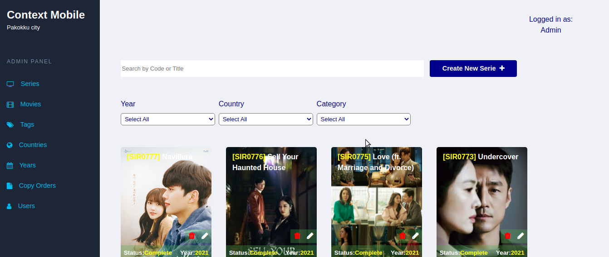
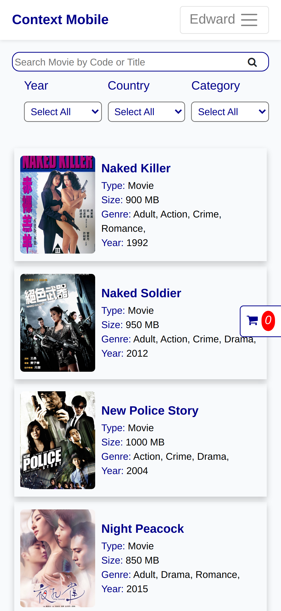
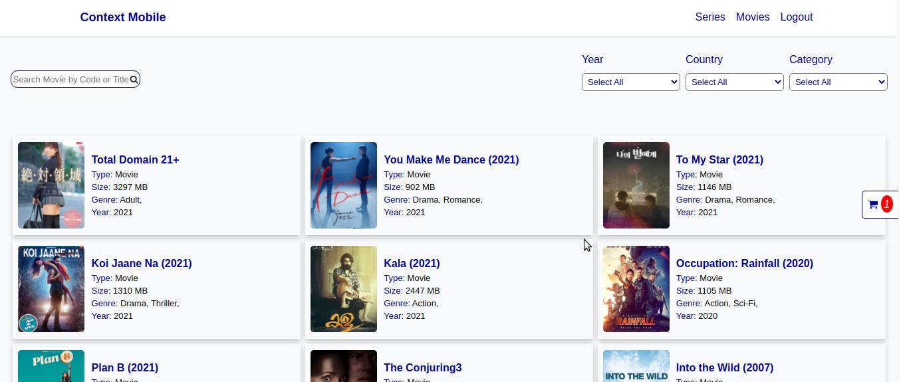
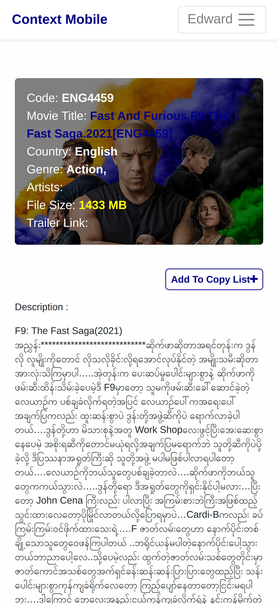
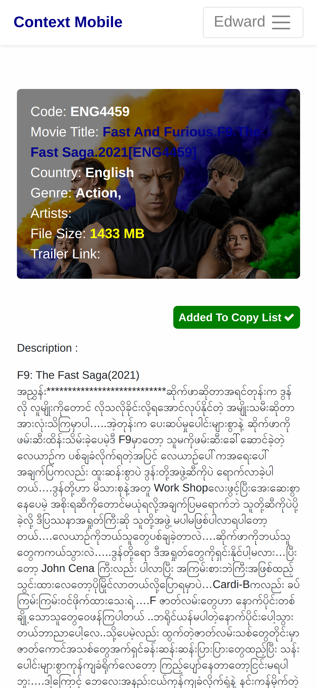
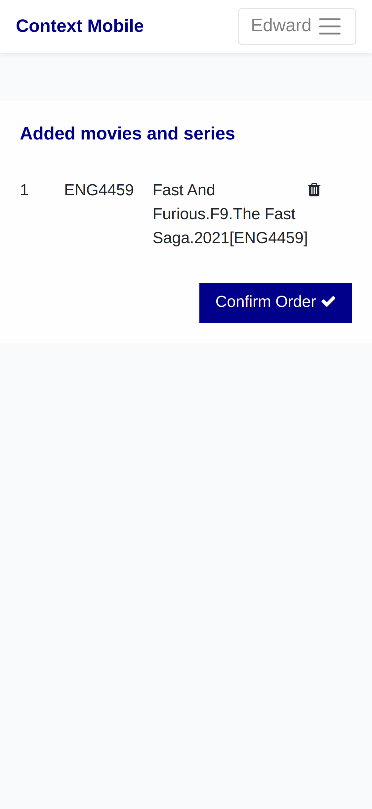
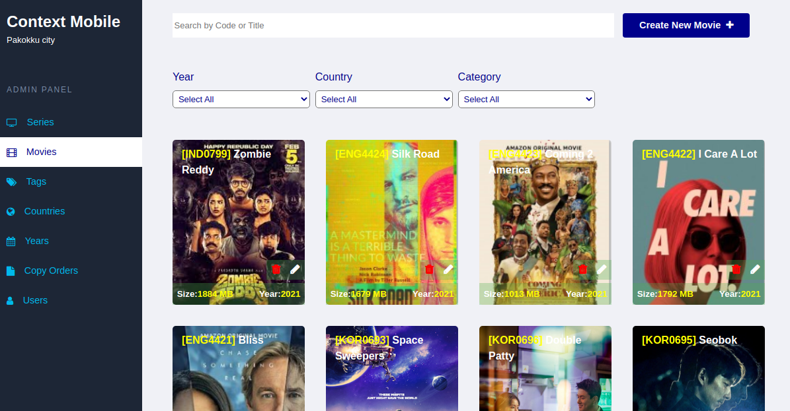
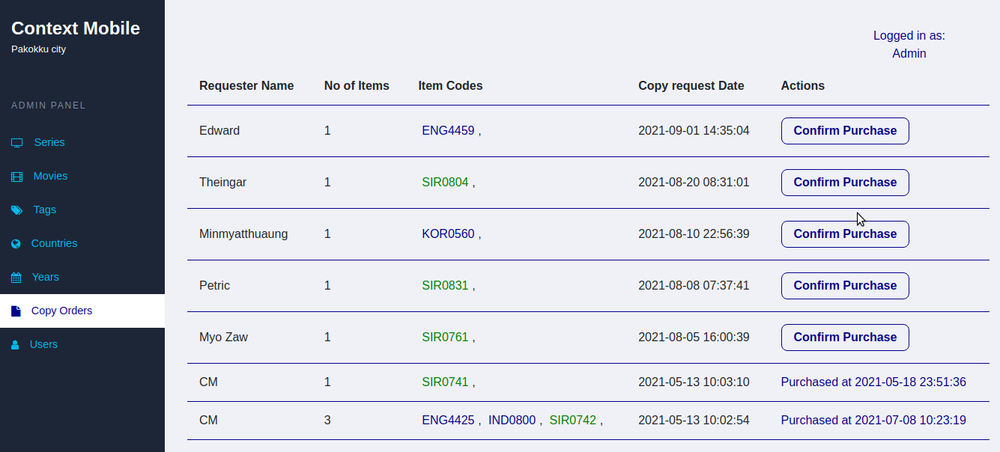

# Movies Reviewer Website ( with admin panel )
> Laravel with blade

This repo can be used by Movie,Serie retailers who need a website for their movie retailer shops instead of using old photo albums systems.

## Scenario

> A user wants to watch favourite series,movies on his or her device , user doens't have enough mobile data to download them so the user buys them from a local unofficial movie,serie retailer shop .In the old days user had to look at an image album to select his favourite movie,serie, he had to record his selected item unique ids on a note and give the note to the shop. This website tries to automate that proces. User can browser , search,filter movies,series in his home, Mark his favourite movie,serie and done. After that he go to the shop, give his registered account name to the shop, the shop uses admin panel to look at orders added by the user,the shop look at the list of item Ids on the order entry, then the shop copies the user his favorite movies,series to his device

## Functions In User App
- Browse Movies , Series and read reviews , compatible for both mobile and desktop.
- Order favorite items(movie,serie) after registering an account.

## User Functions Demos

### -movies list (mobile)

    

### -movies list (desktop)

    

### -movie item detail

    

### -added to cart

    

### -view cart items

    

## Functions In Admin-Panel App
- Manage Tags,Categories,Years 
- Add new movies,Update Movies 
- Add new series,Update Series
- Browse current registered Users
- Browse current orders by users
- Update order status ordered by users

## Admin Panel Function Deoms

### manage movies

    

### manage orders

    

# how to run this site on your own machine

1. clone this repository from a terminal or download it as zip
2. cd into cloned project folder
3. composer install to get dependencies to vender folder
4. cp .env.example .env
5. update your own database credentials (mysql recommended)
6. php artisan storage:link (for image upload,access)
7. php artisan key:generate
8. php artisan serve

# Code structure

I want to refactor code structure it under service,repository pattern but I think for this small site , it shouldn't be needed that much complexity . Any contribution are welcomed.

## License

Lincensed under the [MIT license](https://opensource.org/licenses/MIT).
